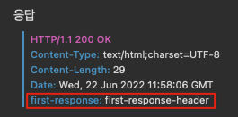

 

# Spring Cloud Gateway 
 

## Spring Cloud Gateway 서비스 설정 
~~~
server:
  port: 8000

eureka:
  client:
    register-with-eureka: false
    fetch-registry: false
    service-url:
      defaultZone: http://localhost:8761/eureka
spring:
  application:
    name: gateway-service
  cloud:
    gateway:
      routes:
        - id: first-service
          uri: http://localhost:8081/
          predicates:
            - Path=/first-service/**
              # http://localhost:8000/first-service/welcome 을 호출하면
              # 위 uri에 Path값을 붙인 http://localhost:8081/first-service/welcome 을 호출하게 된다. 
        - id: second-service
          uri: http://localhost:8082/
          predicates:
            - Path=/second-service/**
              # http://localhost:8000/second-service/welcome 을 호출하면
              # 위 uri에 Path값을 붙인 http://localhost:8082/second-service/welcome 을 호출하게 된다. 
~~~
 

## Spring Cloud Gateway 필터 추가 
### 방법 1. 라우트 정보를 추가한 RouteLocator 빈 등록
application.yml 파일에서 설정했었던 라우트 정보인  
spring.cloud.gateway.routes 설정을 아래와 같이 자바 코드로 설정 가능하다.  
~~~
@Configuration
public class FilterConfig {
    @Bean
    public RouteLocator gatewayRoutes(RouteLocatorBuilder builder) {
        return builder.routes()
                .route(r -> r.path("/first-service/**")
                        .filters(f -> f.addRequestHeader("first-request", "first-request-header")
                                    .addResponseHeader("first-response", "first-response-header"))
                        .uri("http://localhost:8081/"))
                .route(r -> r.path("/second-service/**")
                        .filters(f -> f.addRequestHeader("second-request", "second-request-header")
                                    .addResponseHeader("second-response", "second-response-header"))
                        .uri("http://localhost:8082/"))
                .build();
    }
}
~~~ 
 

http://localhost:8000/first-service/message 로 요청을 보내면 아래와 같이 출력되는 것을 확인할 수 있다.  

#### [실행 결과]  
 
 
 

### 방법 2. application.yml에서 추가 
~~~
...
spring:
  application:
    name: gateway-service
  cloud:
    gateway:
      routes:
        - id: first-service
          uri: http://localhost:8081/   # 이동될 주소
          predicates:
            - Path=/first-service/**    # 로 요청이 들어오면
          filters:
            - AddRequestHeader=first-request, first-request-header2     # 요청 헤더에 first-request를 추가한다.
            - AddResponseHeader=first-response, first-response-header2  # 응답 헤더에 first-response를 추가한다.
        - id: second-service
          uri: http://localhost:8082/
          predicates:
            - Path=/second-service/**
          filters:
            - AddRequestHeader=second-request, second-request-header2
            - AddResponseHeader=second-response, second-response-header2
~~~
 

### 방법 3. AbstractGatewayFilterFactory를 상속 받아서 필터 설정을 추가 
AbstractGatewayFilterFactory를 상속 받아서  
apply(Config config) 메소드를 오버라이딩하여 커스텀하게 설정한 GatewayFilter를 반환하도록 한다.  
=> me.filter.CustomFilter 참조. 

#### [실행 결과]  
 

 

    
