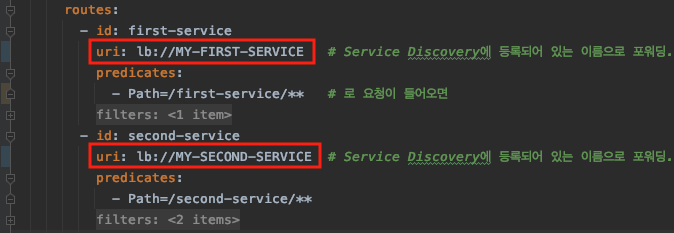

 

# Spring Cloud Gateway 
 

## Spring Cloud Gateway 서비스 설정 
~~~
server:
  port: 8000

eureka:
  client:
    register-with-eureka: false
    fetch-registry: false
    service-url:
      defaultZone: http://localhost:8761/eureka
spring:
  application:
    name: gateway-service
  cloud:
    gateway:
      routes:
        - id: first-service
          uri: http://localhost:8081/
          predicates:
            - Path=/first-service/**
              # http://localhost:8000/first-service/welcome 을 호출하면
              # 위 uri에 Path값을 붙인 http://localhost:8081/first-service/welcome 을 호출하게 된다. 
        - id: second-service
          uri: http://localhost:8082/
          predicates:
            - Path=/second-service/**
              # http://localhost:8000/second-service/welcome 을 호출하면
              # 위 uri에 Path값을 붙인 http://localhost:8082/second-service/welcome 을 호출하게 된다. 
~~~
 

## Spring Cloud Gateway 필터 추가 
### 방법 1. 라우트 정보를 추가한 RouteLocator 빈 등록
application.yml 파일에서 설정했었던 라우트 정보인  
spring.cloud.gateway.routes 설정을 아래와 같이 자바 코드로 설정 가능하다.  
~~~
@Configuration
public class FilterConfig {
    @Bean
    public RouteLocator gatewayRoutes(RouteLocatorBuilder builder) {
        return builder.routes()
                .route(r -> r.path("/first-service/**")
                        .filters(f -> f.addRequestHeader("first-request", "first-request-header")
                                    .addResponseHeader("first-response", "first-response-header"))
                        .uri("http://localhost:8081/"))
                .route(r -> r.path("/second-service/**")
                        .filters(f -> f.addRequestHeader("second-request", "second-request-header")
                                    .addResponseHeader("second-response", "second-response-header"))
                        .uri("http://localhost:8082/"))
                .build();
    }
}
~~~ 
 

http://localhost:8000/first-service/message 로 요청을 보내면 아래와 같이 출력되는 것을 확인할 수 있다.  

#### [실행 결과]  
 
 
 

### 방법 2. application.yml에서 추가 
~~~
...
spring:
  application:
    name: gateway-service
  cloud:
    gateway:
      routes:
        - id: first-service
          uri: http://localhost:8081/   # 이동될 주소
          predicates:
            - Path=/first-service/**    # 로 요청이 들어오면
          filters:
            - AddRequestHeader=first-request, first-request-header2     # 요청 헤더에 first-request를 추가한다.
            - AddResponseHeader=first-response, first-response-header2  # 응답 헤더에 first-response를 추가한다.
        - id: second-service
          uri: http://localhost:8082/
          predicates:
            - Path=/second-service/**
          filters:
            - AddRequestHeader=second-request, second-request-header2
            - AddResponseHeader=second-response, second-response-header2
~~~
 

### 방법 3. AbstractGatewayFilterFactory를 상속 받아서 필터 설정을 추가 
AbstractGatewayFilterFactory를 상속 받아서  
apply(Config config) 메소드를 오버라이딩하여 테스트로 로그를 출력하는 코드를 추가 후  
GatewayFilter를 반환하도록 한다.  

### (1) 특정 서비스에만 적용하는 방법 
#### [application.yml] 
 
#### => <a href="/src/main/java/me/filter/CustomFilter.java">me.filter.CustomFilter</a> 참조. 

#### [실행 결과]  
 

### (2) 모든 서비스에 적용하는 방법
모든 필터들 중 가장 첫번째, 마지막으로 실행된다.  
#### [application.yml] 
 
#### => <a href="/src/main/java/me/filter/GlobalFilter.java">me.filter.GlobalFilter</a> 참조. 

#### [실행 결과]  
 
  

## Spring Cloud Gateway & Eureka 연동 
http://127.0.0.1:8000/first-service/welcome 요청  
-> API Gateway 가 물어봄. -> Eureka Server(Service Discovery)  
(어디에 마이크로서비스가 있는지 위치 정보를 전달 받음.)  
-> API Gateway 가 포워딩함. -> http://127.0.0.1:8081/first-service/welcome  
 

Gateway 서비스에도 아래와 같이 Eureka Client 의존성을 추가한다.  
~~~
<dependency>
    <groupId>org.springframework.cloud</groupId>
    <artifactId>spring-cloud-starter-netflix-eureka-client</artifactId>
</dependency>
~~~

그리고 아래와 같이 uri 설정에 'lb://[포워딩 할 서비스 이름]'을 등록해 준다.  

  

Gateway 서비스와 포워딩할 서비스들을 실행하면 아래와 같이 Eureka 서버에 등록이 되고,  
Gateway 서비스로 요청 시 해당 서비스로 포워딩되는 것을 확인할 수 있다.  

#### [실행 결과]  
  
  
  

## 랜덤 포트 서비스
springcloud-first-service를 랜덤 포트로 설정 후 (server.port=0)  

  

아래와 같이 코드를 추가하면 랜덤으로 지정된 포트 번호를 출력해 볼 수 있다.  

  

요청을 계속 보내보면 라운드로빈으로 로드밸런싱이 되는 것을 확인할 수 있다.  

  
  

    
